# Домашнее задание к занятию "`Работа с данными (DDL/DML)`" - `Иванов Сергей`

## ✅ Задание 1

📝 Задание:

1.1 Поднимите чистый инстанс MySQL версии 8.0+. Можно использовать локальный сервер или контейнер Docker.

1.2 Создайте учётную запись sys_temp.

1.3 Выполните запрос на получение списка пользователей в базе данных. (скриншот)

1.4 Дайте все права для пользователя sys_temp.

1.5 Выполните запрос на получение списка прав для пользователя sys_temp. (скриншот)

1.6 Переподключитесь к базе данных от имени sys_temp.

Для смены типа аутентификации с sha2 используйте запрос:

```sql
ALTER USER 'sys_test'@'localhost' IDENTIFIED WITH mysql_native_password BY 'password';
```

1.7. По ссылке https://downloads.mysql.com/docs/sakila-db.zip скачайте дамп базы данных.

1.8. Восстановите дамп в базу данных.

1.9. При работе в IDE сформируйте ER-диаграмму получившейся базы данных. При работе в командной строке используйте команду для получения всех таблиц базы данных. (скриншот)

Результатом работы должны быть скриншоты обозначенных заданий, а также простыня со всеми запросами.

### Решение

#### 🔹 1.1 Поднятие локального инстанса базы данныйх MySQL версии 8.0.28 на Ubuntu 22.04:

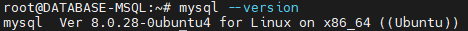

*Рис. 1. Проверка версии*

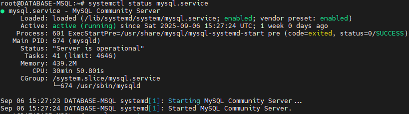

*Рис. 2. Статус Syslog*

#### 🔹 1.2 Создание учётной записи sys_temp.

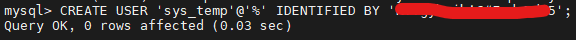

*Рис. 3. Создание учетной записи sys_temp*

#### 🔹 1.3 Выполение запроса на получение списка пользователей в базе данных. (скриншот)

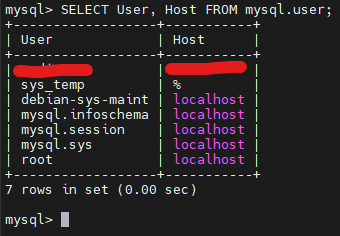

*Рис. 4. Таблица пользователей*

#### 🔹 1.4 Установка "ALL" прав для пользователя sys_temp.

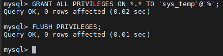

*Рис. 5. Установка "ALL" прав для пользователя sys_temp*

#### 🔹 1.5 Выполение запроса на получение списка прав для пользователя sys_temp. (скриншот)

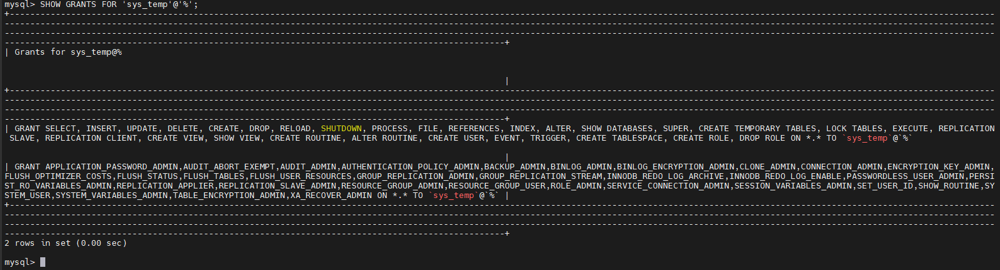

*Рис. 6. Cписка прав для пользователя sys_temp*

#### 🔹 1.6 Подключение к базе данных от имени sys_temp.

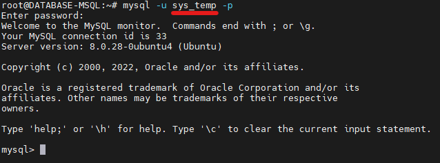

*Рис. 7. Подключение к базе данных от имени sys_temp*

#### 🔹 1.7 Загрузка по ссылке https://downloads.mysql.com/docs/sakila-db.zip  дампа базы данных.

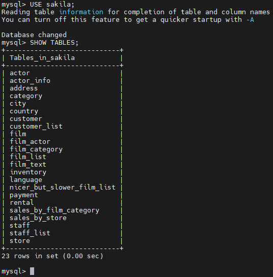

*Рис. 8. Отображение списка таблиц базы данных sakila*


#### 🔹 1.8 Восстановление дампа в базы данных.

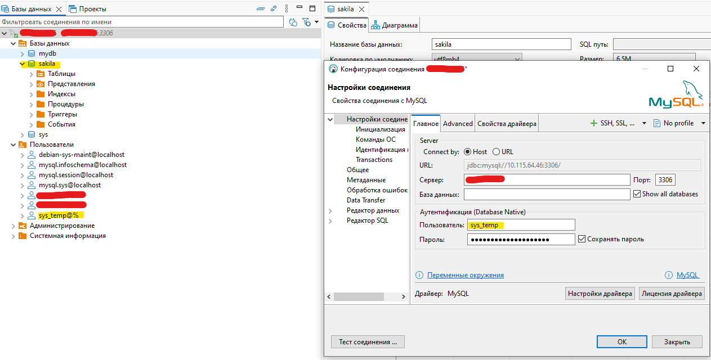

*Рис. 9. Подключение к базе данных от имени sys_temp*

#### 🔹 1.9 ER-диаграмма базы данных. 

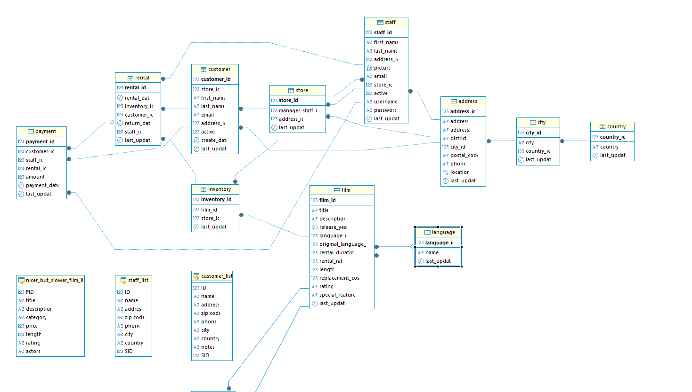

*Рис. 10. ER-диаграмма базы данных sakila*

## Задание 2

Составьте таблицу, используя любой текстовый редактор или Excel, в которой должно быть два столбца: в первом должны быть названия таблиц восстановленной базы, во втором названия первичных ключей этих таблиц. Пример: (скриншот/текст)

```
Название таблицы | Название первичного ключа
customer         | customer_id
```

### Решение

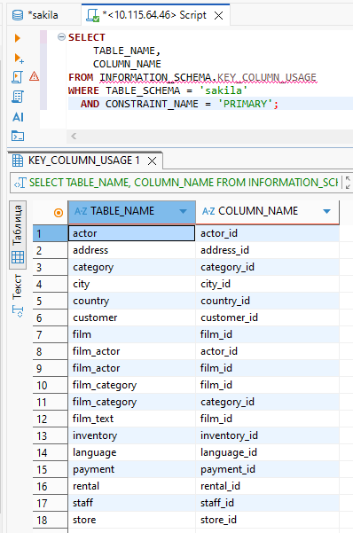

*Рис. 11. Скриншот с телом запроса*э

Тестовая часть запроса:
```sql
SELECT 
    TABLE_NAME,
    COLUMN_NAME 
FROM INFORMATION_SCHEMA.KEY_COLUMN_USAGE
WHERE TABLE_SCHEMA = 'sakila' 
  AND CONSTRAINT_NAME = 'PRIMARY';
```

## Дополнительные задания (со звёздочкой*)
**Эти задания дополнительные, то есть не обязательные к выполнению, и никак не повлияют на получение вами зачёта по этому домашнему заданию. Вы можете их выполнить, если хотите глубже шире разобраться в материале.**

## Задание 3*
3.1. Уберите у пользователя sys_temp права на внесение, изменение и удаление данных из базы sakila.
3.2. Выполните запрос на получение списка прав для пользователя sys_temp. (скриншот)

Результатом работы должны быть скриншоты обозначенных заданий, а также простыня со всеми запросами.

### Решение:

```sql
-- 1. Отзываем ВСЕ глобальные права
REVOKE ALL PRIVILEGES ON *.* FROM 'sys_temp'@'%';
REVOKE GRANT OPTION ON *.* FROM 'sys_temp'@'%';

-- 2. Отзываем административные роли (если есть)
-- MySQL 8+ требует явного отзыва ролей
-- Но проще: заново назначить только нужное

-- 3. Даём ТОЛЬКО право читать данные из sakila
GRANT SELECT ON sakila.* TO 'sys_temp'@'%';

-- 4. Применяем изменения
FLUSH PRIVILEGES;
```

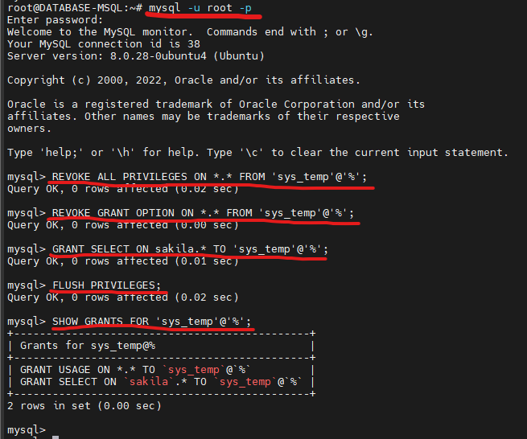

*Рис. 11. Скриншот выполнения запросов*
